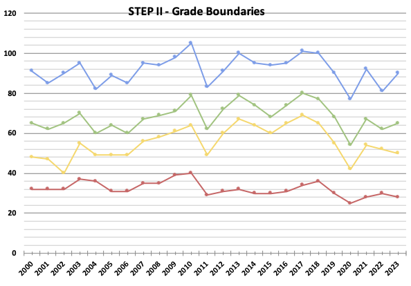
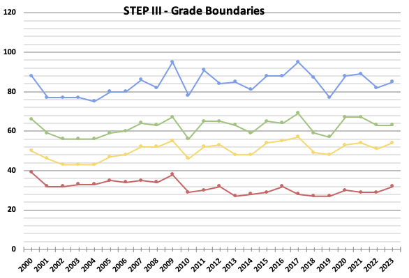

# STEP Resources
This is a collation of freely and publicly available resources for
STEP Prep collated into a useful central repository by Zain Patel. You
can download a zipped version of this repository here:
https://github.com/mzjp2/step-resources/archive/master.zip

### [Download this repository](https://github.com/mzjp2/step-resources/archive/master.zip)

# Forums

## STEP Prep Thread
The current [STEP Prep Thread](https://www.thestudentroom.co.uk/showthread.php?t=5537494) can be found [here](https://www.thestudentroom.co.uk/showthread.php?t=5537494).

The main post in the threads contain various useful information, from
links to _all_ solutions, to a FAQ and advice regarding STEP and the
application process for maths at Cambridge. If you cannot find what
you're looking for, please use the thread to ask for help. It's a
friendly and collaborative environment and greatly helped me when I
was doing STEP in 2015 and 2016.

_Disclaimer:_ I am the thread owner and maintainer for the thread (as well as a few of the previous incarnations). (Zacken)

## Cambridge STEP Support Programme
The [Cambridge STEP Support Programme](https://maths.org/step/) (that's a mouthful) is a Cambridge-run initiative to help university applicants develop their advanced mathematical problem solving skills and prepare for the STEP examinations. They offer various assignments to ease you into the STEP style and can be a valuable resource. They also [have a forum](https://maths.org/step/forum) where anybody can participate. You are free to ask for help regarding any of the assignments or STEP on there.

_Disclaimer:_ I am a mentor on the programme. (mzjp2)

# Resources

## Question Papers

Every year of STEP papers from the specimen in 1983 to STEP 2023 is
currently in this repository. Where available, the hints and solutions
and examiner reports have also been provided.

## Change of examiner
The examiner is OCR as of 2024. The old admissionstesting.org website links are out of date.

## Specification changes
STEP has undergone a specification change in 2019 onwards.
This is no cause for alarm, the style of STEP will still be broadly similar, there will just be a rearrangement of content to tailor for the new A-Level linear syllabi. These past papers will still be instrumental in preparation and still very useful.

The [2024 specification](https://www.ocr.org.uk/Images/696329-step-specification-2024.pdf) is on the OCR website.

A [diff of the two new and old specification](https://maths.org/step/sites/maths.org.step/files/assignments/STEP%20spec%20mapping%20document%202020.pdf) has also been provided by the step.maths.org team.

## Markschemes
The years that have official markschemes published have their markschemes included in the repository. I am working on adding various markschemes for years in which the markschemes were released via FoI requests or the like.

## Booklets
The old and new version of the booklets are named so because Siklos collated both booklets, formerly "Advanced Problems in Core Mathematics" broadly meant for STEP I and STEP II and "Advanced Problem in Mathematics" broadly meant for STEP III into one booklet called "Advanced Problem in Mathematics". The content is largely the same, with a few new questions in the new version from recent past papers.

## Question spreadsheet
The STEP questions spreadsheet is meant to be printed and the relevant box ticked off when you complete that question. If you're keen, you may want to try colour coding your boxes (green for completed/yellow for so and so and red for having to come back to it). You can also potentially give yourself a tentative score out of 20 in the boxes as another idea. I found this useful when I was preparing for STEP, you of course, don't need to use it if you don't feel like.

## Grade Boundaries
### Table Form

### Graphs

#### STEP I boundaries

#### STEP II boundaries

#### STEP III boundaries

### Good luck!
